# Windows

The easiest way to run the code on Windows is to install [Visual Studio](https://www.visualstudio.com/).

When you install it, be sure to install `Desktop development with C++` and select all optional features.

## Installation

If you did not install the `Desktop development with C++`, open Visual Studio and select `Continue without code →`.

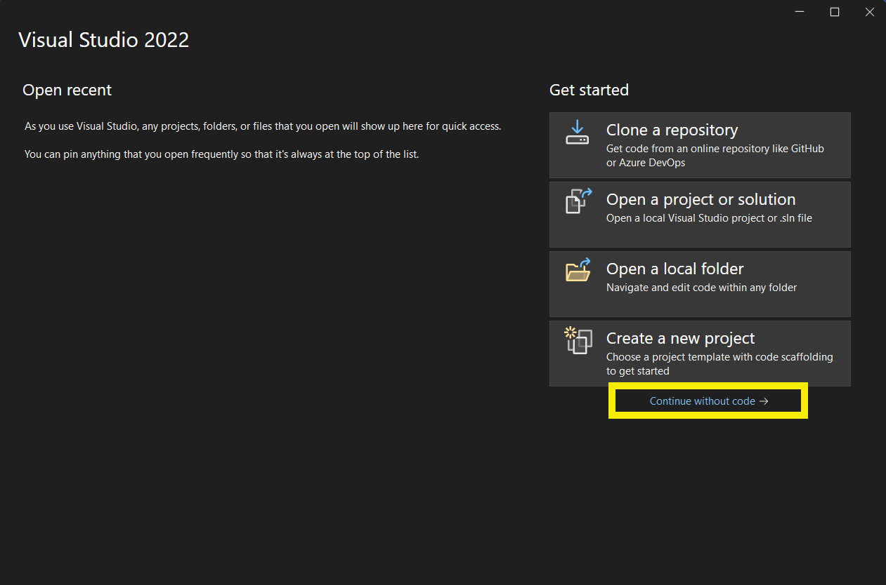

This will open Visual Studio. Select the `Tools` menu and open `Get Tools and Features...`.

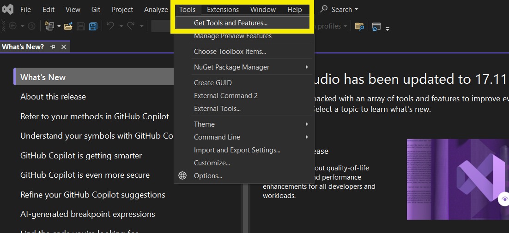

This will open a menu similar to that when you first install it. Select `Desktop development with C++` (and select all optional features). Then confirm by pressing `Modify`.

This will take a while (depending on your network).

## Running the code

When you open Visual Studio, select `Create a new project`.

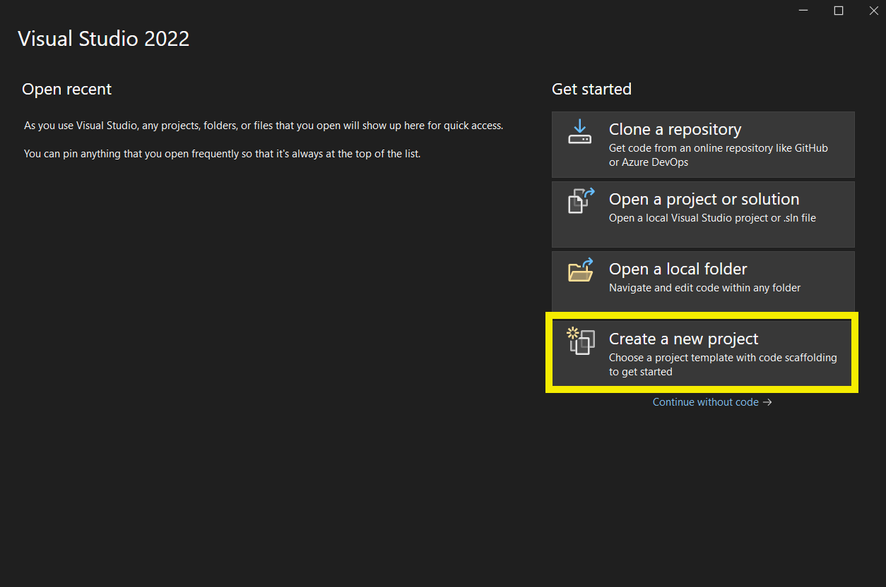

This will open a new window where you select which project. If everything is installed correctly, you should have `Console App` in the menu and click next. If not, check [Installation](installation).

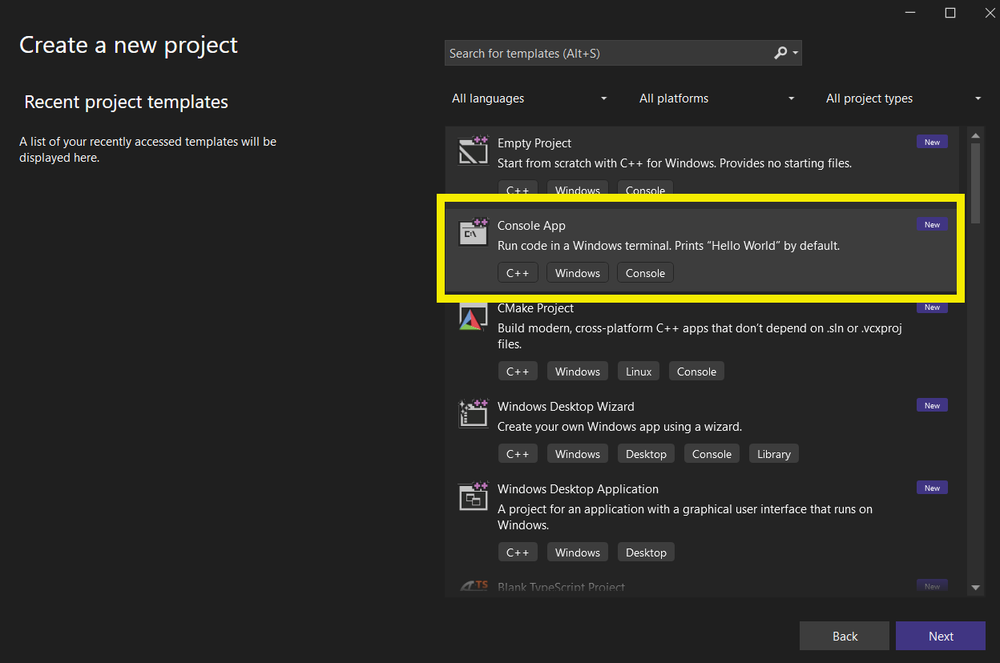

The next window lets you choose the path and project name. Choose something that makes sense to you and press `create`.

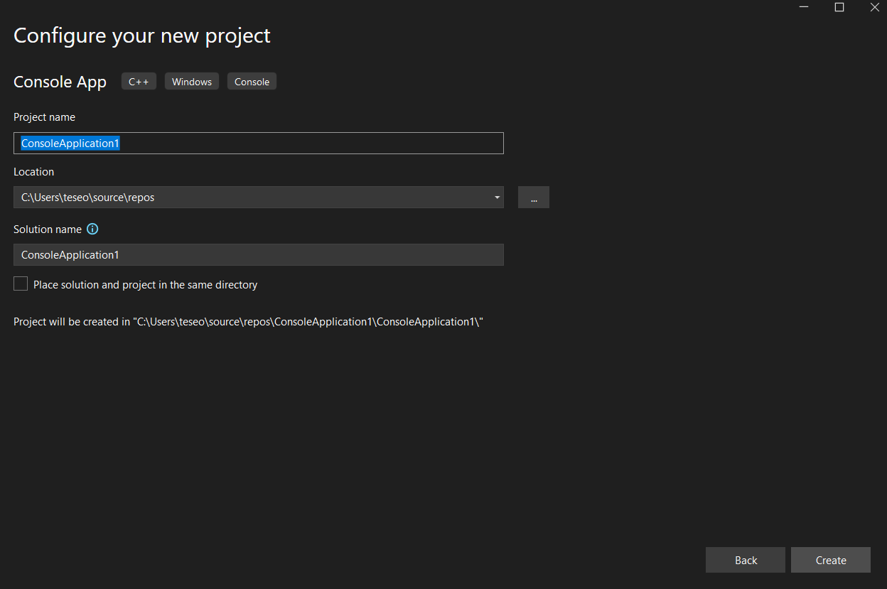

Finally, you should have a `C++` file open in the middle with some sample code.

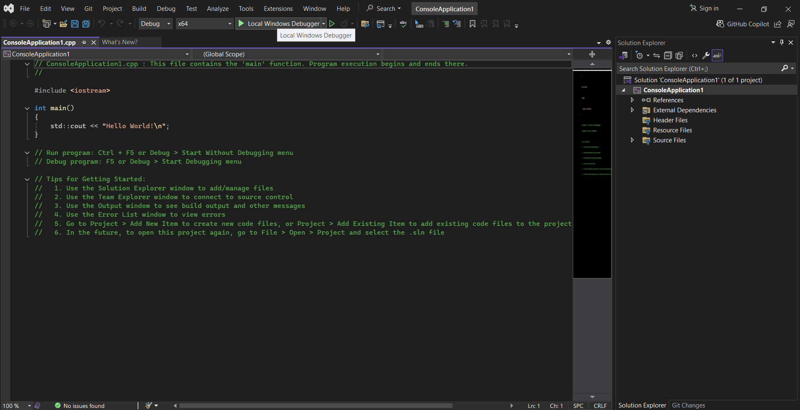

To **save, compile, and run** the code, press the play button.

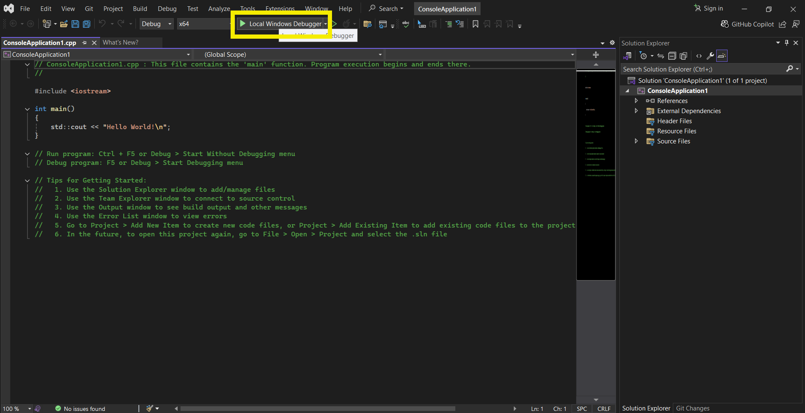

After compilation, a terminal should pop up with the program's output. The terminal also contains other stuff — look at the first line!

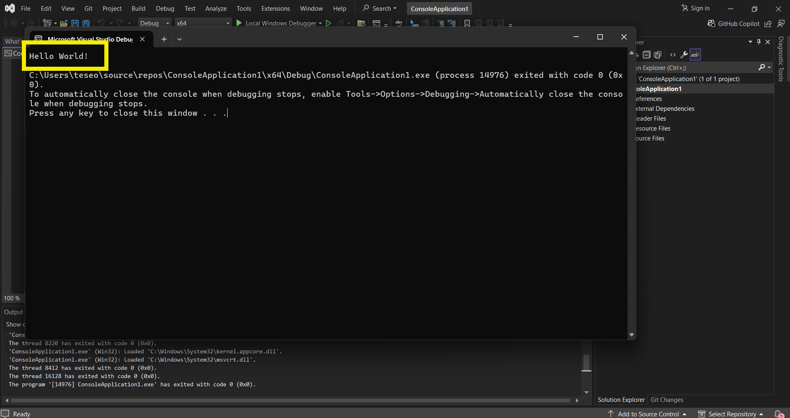

## Running the class Examples

To run any other code, copy-paste the code over the cpp file.

Alternatively, you can drag and drop one of the cpp files into the `Source Files` project's directory.

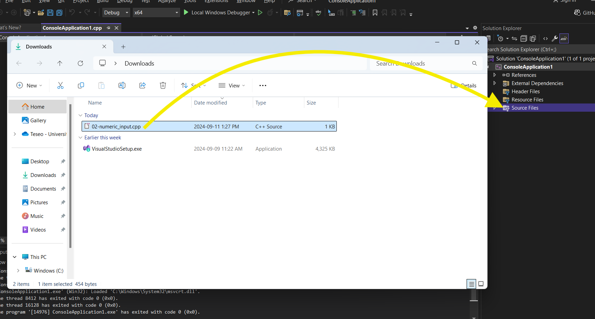

By doing so, you should have your new file inside (you might need to expand the folder in Visual Studio)

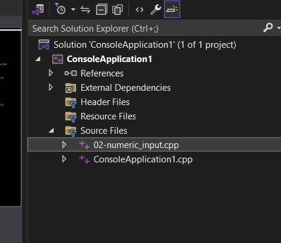

By pressing play, you will get an error since there are two files containing a `main`.

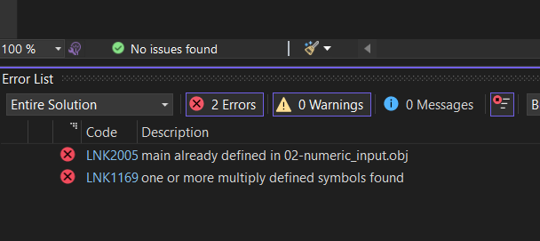

In general, it is helpful to see the error panel; if you do not have it, you can open `View` and select `Error List`.

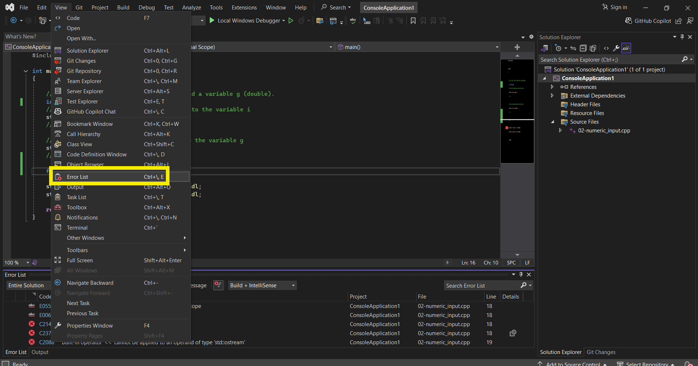

To fix the error, right-click on the file you want to skip (in our case, `ConsoleApplication1.cpp`) and select `Exclude From Project`. This will exclude the file from the project but not delete it.

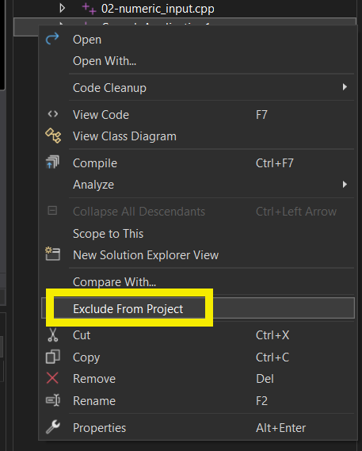

If you want to add back an excluded project, right-click on the `Source Files` directory and select `Add > Existing Item...`.

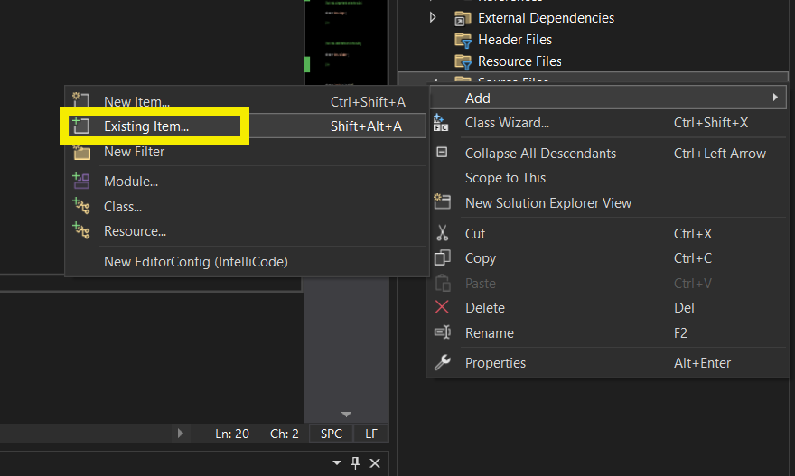

This will open a menu where you can select the file you want to add.

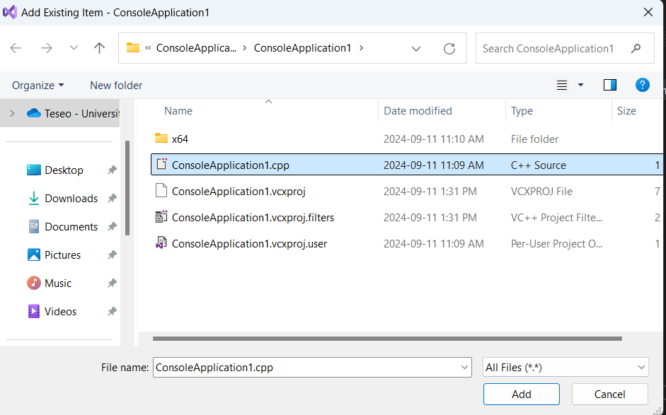
